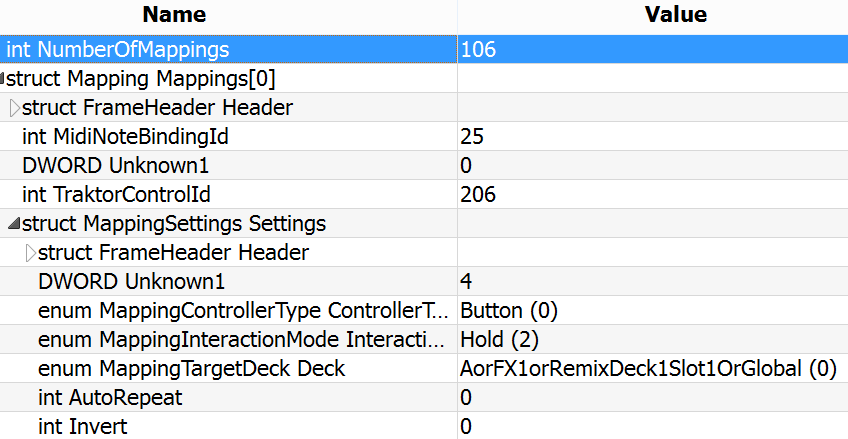
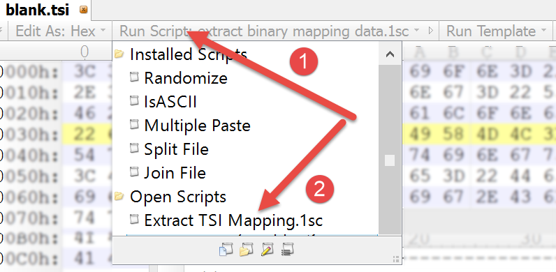
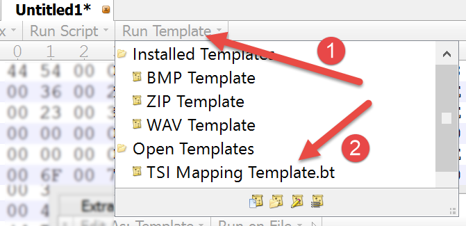
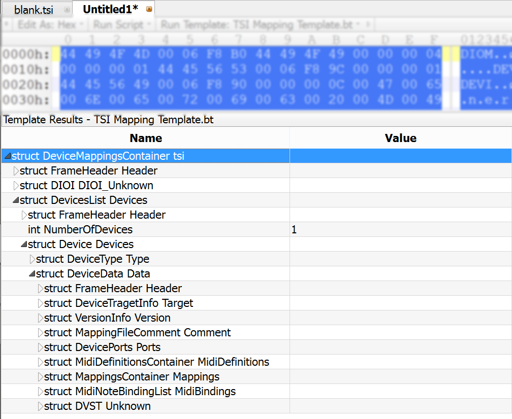
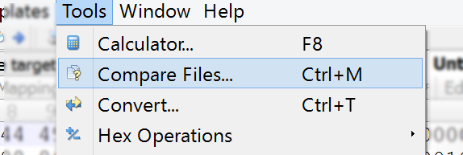
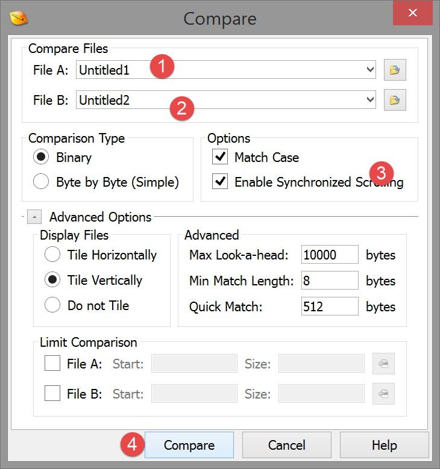

# Table of Contents

- [Setting up](#settingUp)
- [Making and Contributing Changes](#makingChanges)

<a name="settingUp"></a>
# Setting up

In order to be able to browse the Traktor .tsi file like on the screenshot below and contribute back to this project you need to follow a couple of simple steps.



## Step 1: Install the 010 Editor by SweetScape

The tool used to reverse-engineer the .tsi file format is the 010 Editor which you can [download from here](http://www.sweetscape.com/010editor/).

It's a hex editor, but also enables defining a data structure template for the file being viewed and provides scripting capabilities

## Step 2: Set up the 010 Editor

In the [Tools folder](https://github.com/ivanz/TraktorMappingFileFormat/tree/master/Tools) you will find two files, which you need to open in 010 Editor:

* [Extract TSI Mapping.1sc](https://github.com/ivanz/TraktorMappingFileFormat/blob/master/Tools/Extract%20TSI%20Mapping.1sc) - script used to automatically extract the binary data from the .tsi file.
* [TSI Mapping Template.bt](https://github.com/ivanz/TraktorMappingFileFormat/blob/master/Tools/TSI%20Mapping%20Template.bt) - file structure definition

## Step 3: Process a .tsi file

1. Open the Script and Template from Step 2
2. Open a .tsi file. (For example one of those under "Samples" or export one from Traktor Pro)
3. Run the *Extract TSI Mapping.1sc* script. It may take a couple of seconds to finish. Once done a new tab will automatically open _Untitled1_

 

4. Apply the data structure template (*TSI Mapping Template.bt*)

 

5. Use the newly opened **Template Results** panel in the bottom to explore:

 


----------
<a name="makingChanges"></a>
# Making and Contributing Changes

## What's in the *TSI Mapping Template.bt* file?

All of the .tsi data structures are defined in the ## file using the 010 Editor Templates functionality.

Essentially the Template file contains C-like structures, enums  and scripting abilities. Here is an example of the structure that defines the mapping comment (which Traktor uses as the name of the mapping)

```C
typedef struct MappingFileComment {
    FrameHeader Header;
    int CommentLength;
    wchar_t Comment[CommentLength];
};
```

Simply edit the template, save and re-run it.

010 Editor Templates quick start documentation here: http://www.sweetscape.com/010editor/manual/IntroTempScripts.htm

## Using File Compare

Using File Compare within 010 Editor is a great way to find out how a change in Traktor propagates to the .tsi file. Create a before and after .tsi files and compare the outputs (after doing the described in Step 3: Process a .tsi file from the Setting up guide above) to figure out what is what:




